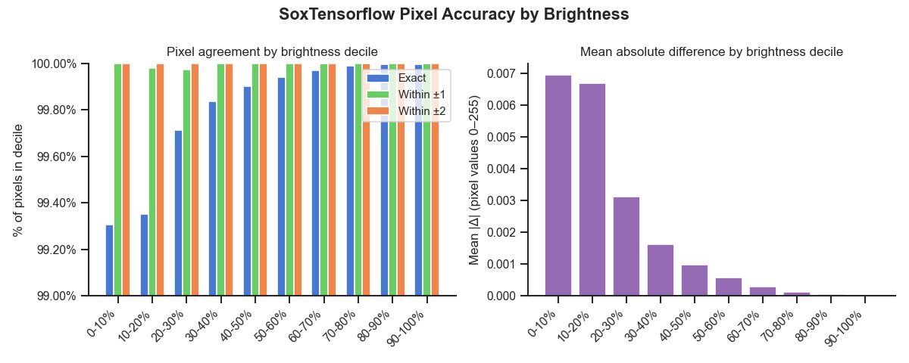

# sox_tensorflow

TensorFlow implementation of SoX-style spectrogram generation that uses TensorFlow operations for GPU acceleration.

**LINKS**

- sox: https://github.com/chirlu/sox
- pysox: https://github.com/marl/pysox
- audio samples:
	* https://storage.googleapis.com/dse-soundhub-public/data/sample_audio/20230522_000000.flac
	* https://storage.googleapis.com/dse-soundhub-public/data/sample_audio/20230526_000000.flac
- pnw-cnet-model: https://storage.googleapis.com/dse-soundhub-public/models/pnw-cnet/PNW-Cnet_v4_TF.h5

Our analysis shows 

- sox_tensorflow spectrograms are 99.81% exact-pixel-match on average relative to sox.
- Every segment falls within ±2 pixel values
- The small residual error is concentrated in the darkest pixels (0–10% brightness decile: ~99.3% accuracy) and vanishes almost entirely in brighter regions where the signals live
- 100% agreement with top-5 ranks agreement when passed through [PNW-Cnet v4 model](https://github.com/zjruff/Shiny_PNW-Cnet)
- The model-output classes with the largest mean absolute difference are BUVI and PSFL (around 0.0004)



For more details see the scripts and notebooks found in the [comparison folder](comparison/).

---

## QUICK START

```python
import soundfile as sf
import tensorflow as tf
from sox_tensorflow import spectrogram, spectrogram_from_flac

# From a numpy array
samples, sr = sf.read('audio.flac', dtype='float64', always_2d=True)
samples = samples[:, 0]  # mono
pixels = spectrogram(
    audio_array=tf.constant(samples, dtype=tf.float64),
    shape=(257, 1000),
    sample_rate=sr,
    dest='spectrogram.png'
)


# From a FLAC file directly
path = spectrogram_from_flac(
    flac_path='audio.flac',
    shape=(257, 1000),
    duration=12.0,
    segment=0,
    dest='spectrogram.png'
)
```

---

## API

### `spectrogram(audio_array, shape, dest, ...)`

Generates a SoX-matching spectrogram from an audio array or TensorFlow tensor.

| Argument | Type | Description |
|---|---|---|
| `audio_array` | `tf.Tensor` or `np.ndarray` | Audio samples, float32/float64 in [-1, 1] |
| `shape` | `(int, int)` | Output shape as `(height, width)`. Height determines frequency resolution: DFT size = 2 × (height − 1) |
| `dest` | `str` or `Path`, optional | Output PNG path. If `None`, returns a `tf.Tensor` |
| `segment` | `int`, optional | Segment index (0-based) to extract from the audio |
| `segment_duration` | `float`, optional | Duration of each segment in seconds |
| `segment_overlap` | `float`, optional | Overlap between segments in seconds |
| `sample_rate` | `int` | Sample rate of the input audio in Hz |
| `output_sample_rate` | `int` | Sample rate for spectrogram generation (default: 8000) |
| `db_range` | `int` | Dynamic range in dB (default: 90) |

Returns a `tf.Tensor` of pixel values (`uint8`, shape `(height, width)`) if `dest` is `None`, otherwise the path to the saved PNG.

### `spectrogram_from_flac(flac_path, shape, dest, ...)`

Convenience wrapper that loads a FLAC file and generates a spectrogram in one call. Accepts the same shape/segment/dest arguments as `spectrogram()`, plus:

| Argument | Type | Description |
|---|---|---|
| `flac_path` | `str` | Path to FLAC file |
| `start_time` | `float`, optional | Start time in seconds |
| `duration` | `float` | Duration in seconds (default: 12) |
| `channel` | `int` | Channel to extract (default: 0) |

### `load_audio(flac_path, start_time, segment, duration, channel)`

Reads a FLAC file into a `tf.Tensor`. Returns `(tensor, sample_rate)`.

---

## NOTES

### PNW-Cnet compatibility

When loading H5 models saved with older TensorFlow/Keras versions, set:

```bash
export TF_USE_LEGACY_KERAS=1
```

This forces TensorFlow 2.16+ to use the legacy Keras implementation, which maintains compatibility with older H5 model files.

### SoX accuracy

The implementation replicates SoX's spectrogram algorithm exactly:
- Hann window with SoX-specific normalization
- FFT with SoX edge handling (partial windows at start/end of signal)
- dB conversion and pixel rendering matching SoX's palette

Resampling uses `soxr` (the SoX Resampler library) at HQ quality, achieving 99.8%+ pixel match with the SoX binary.

---

## STYLE-GUIDE

Following PEP8. See [setup.cfg](./setup.cfg) for exceptions. Keeping honest with `pycodestyle .`
