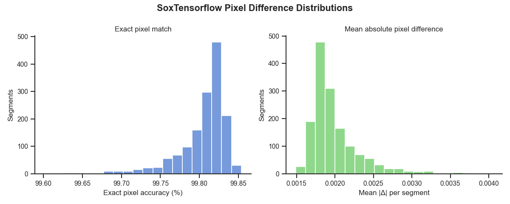
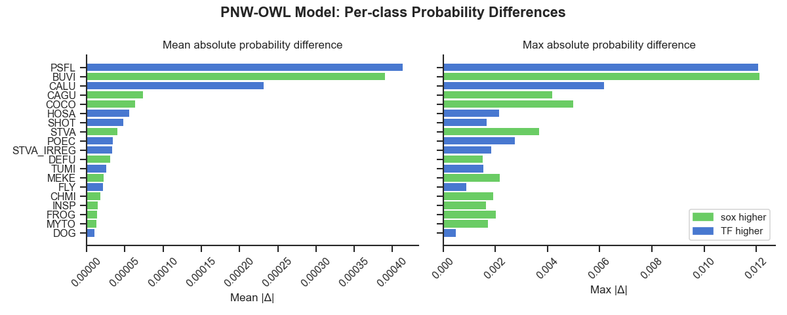

# SoxTensorflow: Spectrogram Analysis

[SoxTensorflow](https://github.com/SchmidtDSE/sox_tensorflow) is a TensorFlow implementation of [SoX](https://github.com/chirlu/sox) spectrogram generation, allowing for GPU accelration when generating spectrograms. 

The resulting spectrograms are close, though not identical to the SoX spectrograms.  Here we look at how closely the tf-sox-spectrograms to match sox-spectrograms. We do this comparison, both overall and at different levels of brightness. We then look at the differences when spectorgrams are passed through a model.

---

## Results — PNW-OWL reference run

The reference run used 150 12-second segments from each of the 10-audio files contained at s3://dse-soundhub/public/audio/dev.  For model-output comparisons the [PNW-Cnet v4 model](https://github.com/zjruff/Shiny_PNW-Cnet) was used.

- sox_tensorflow spectrograms are 99.81% exact-pixel-match on average relative to sox.
- Every segment falls within ±2 pixel values
- The small residual error is concentrated in the darkest pixels (0–10% brightness decile: ~99.3% accuracy) and vanishes almost entirely in brighter regions where the signals live
- 100% agreement with top-5 ranks agreement when passed through [PNW-Cnet v4 model](https://github.com/zjruff/Shiny_PNW-Cnet)
- The model-output classes with the largest mean absolute difference are BUVI and PSFL (around 0.0004)

### Spectrogram pixel accuracy




### Model prediction agreement



---

## Getting started

### 1. Configure

All paths and parameters live in `config.yaml`. Edit it before running:

```yaml
# Audio to compare — local paths, directories, or S3 URIs
audio:
  - s3://my-bucket/audio/file.flac   # single file
  # - s3://my-bucket/audio/          # or an entire prefix
  # - path/to/local/audio/           # or a local directory

# Number of random 12-second segments to sample per audio file
n_samples: 50
seed: 42

# Where to write CSVs and spectrograms  (creates <output>/results/ and <output>/spectrograms/)
output: outputs

# Model comparison
model: s3://my-bucket/models/my_model.h5        # local path or S3 URI
target_classes: s3://my-bucket/models/classes.csv
spectrograms: spectrograms                       # relative to output, or absolute
```

All CLI flags override config values. S3 URIs are supported for audio, model,
and classes. Public buckets work without credentials; private buckets are read
from the standard AWS credential chain (`~/.aws/credentials`, env vars, IAM role).

### 2. Run

**With pixi (recommended):**

```bash
pixi run --environment test compare-spectrograms
pixi run --environment test compare-model
```

**Or directly:**

```bash
python compare_spectrograms.py
python compare_model.py
```

### 3. Analyse

Open the notebook for your run. The reference PNW-OWL notebook is included;
copy and rename it for your own data:

```bash
cp analysis.pnw-owl.ipynb analysis.my-run.ipynb
jupyter lab analysis.my-run.ipynb
```

The notebook reads paths from `config.yaml` automatically — just set
`CONFIG_PATH` in the first cell if your config is not in the default location.

---

## Files

| File | Description |
|---|---|
| `config.yaml` | Default configuration for both scripts |
| `compare_spectrograms.py` | Generates spectrogram pairs (sox + sox_tensorflow) and compares pixel-by-pixel |
| `compare_model.py` | Runs a model on existing spectrogram pairs and compares predictions |
| `analysis.pnw-owl.ipynb` | Reference analysis notebook for the PNW-OWL model |
| `models/README.md` | PNW-Cnet v4 citation and class list |

---

## compare_spectrograms.py

```bash
# via pixi
pixi run --environment test compare-spectrograms [audio...] [options]

# directly
python compare_spectrograms.py [audio...] [options]
```

`audio` can be one or more local file paths, directories, or S3 URIs.
If omitted, the `audio` list from `config.yaml` is used.
Supported formats: FLAC, WAV, MP3, OGG.

| Flag | Default | Description |
|---|---|---|
| `--config` | `config.yaml` | YAML config file; CLI flags override it |
| `--output`, `-o` | (from config) | Base output directory — CSVs go to `<output>/results/`, spectrograms to `<output>/spectrograms/` |
| `--n-samples`, `-n` | 50 | Random 12-second segments per audio file |
| `--seed` | 42 | Random seed for reproducible segment selection |

**Output files:**

| File | Description |
|---|---|
| `<output>/results/overall_comparison.csv` | Per-segment pixel statistics |
| `<output>/results/percentile_comparison.csv` | Per-segment statistics by brightness decile |
| `<output>/spectrograms/*.sox.png` | Spectrograms from the sox binary |
| `<output>/spectrograms/*.tf.png` | Spectrograms from sox_tensorflow |

---

## compare_model.py

```bash
# via pixi
pixi run --environment test compare-model [options]

# directly
python compare_model.py [options]
```

Reads matched `.sox.png` / `.tf.png` pairs from the spectrograms directory and
compares model predictions.

| Flag | Default | Description |
|---|---|---|
| `--config` | `config.yaml` | YAML config file; CLI flags override it |
| `--model`, `-m` | (from config) | Path or S3 URI to Keras `.h5` model |
| `--classes`, `-c` | (from config) | Path or S3 URI to class label CSV |
| `--spectrograms`, `-s` | (from config) | Directory of `.sox.png` / `.tf.png` pairs |
| `--output`, `-o` | (from config) | Base output directory — CSVs go to `<output>/results/` |

**Output files:**

| File | Description |
|---|---|
| `<output>/results/model_comparison.csv` | Per-pair prediction summary including rank 1–5 agreement |
| `<output>/results/model_class_diffs.csv` | Per-class probability differences across all pairs |

---

## Using your own model

Point `--model` and `--classes` at any Keras `.h5` model and a CSV with a
`Class` column (one row per output class, in softmax order):

```bash
# via config.yaml
model: /path/to/my_model.h5
target_classes: /path/to/my_classes.csv

# or directly on the CLI
python compare_model.py \
  --model /path/to/my_model.h5 \
  --classes /path/to/my_classes.csv
```

For your own analysis notebook:

```bash
cp analysis.pnw-owl.ipynb analysis.my-model.ipynb
jupyter lab analysis.my-model.ipynb
```

---

## S3 support

S3 URIs (`s3://bucket/key`) are accepted for audio files, model, and classes.
Public buckets work without credentials. For private buckets, credentials are
read from the standard AWS credential chain.

For public bucket listing (`s3://bucket/prefix/`) the bucket policy must allow
`s3:ListBucket` in addition to `s3:GetObject`.

---

## Full example

```bash
# Edit config for your run
vim config.yaml

# Generate spectrogram pairs
pixi run --environment test compare-spectrograms

# Compare model predictions
pixi run --environment test compare-model

# Open a copy of the notebook for this run
cp analysis.pnw-owl.ipynb analysis.my-run.ipynb
jupyter lab analysis.my-run.ipynb
```
